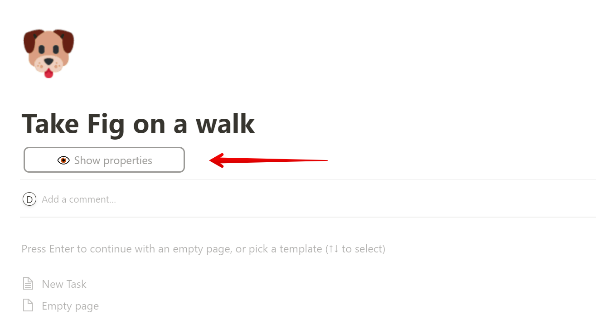
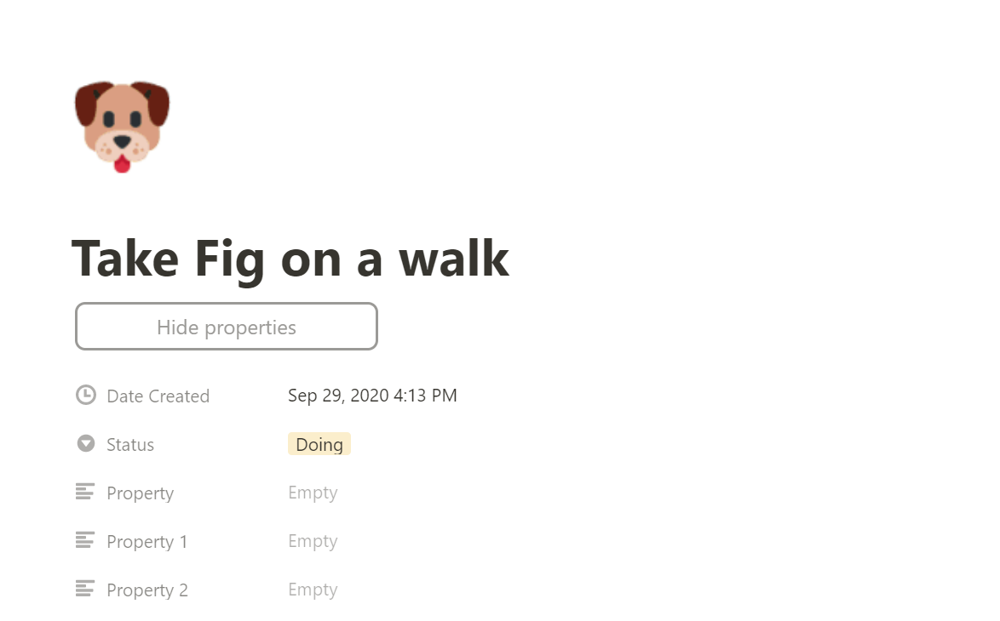

# Notion Page Properties Toggle, Chrome Extension

This simple Chrome Extension adds a button that allows you to show/hide in-page properties in Notion. It only works for Chrome at the moment.

To install, follow these instructions by Alexander Kazakov (he's author of the original version, we just updated the button look and feel):

## How to install?
1. Download the whole repo as Zip file (see green button "Code" in top right of this page)
2. Open Chrome Extension chrome://extensions
3. Enable "Developer Mode" (top right)
4. Unzip the downloaded folder
5. Drag & drop the unzipped folder into Chrome extensions window
6. Enjoy

YouTube video that shows steps 2-5: https://www.youtube.com/watch?v=5W9ZPEaVMWE

